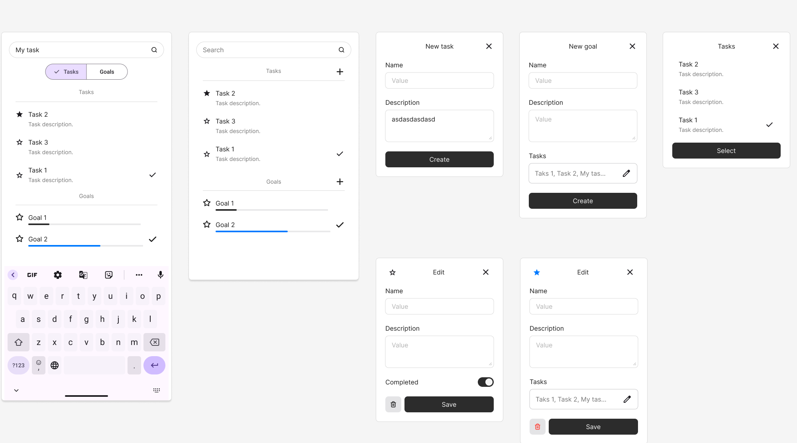

# TodoTasks Frontend

https://todo-tasks-frontend.onrender.com/

Aplicacion frontend web desarrollada en React, diseñada para gestionar un sistema simple de tareas y objetivos.
Este es un proyecto de practica para implementar el desarrollo basico de un sistema frontend en React

El proyecto es de uso libre por cualquiera que desee descargarlo y editarlo.  

## API backend
La aplicacion utiliza una API backend que desarrollé en ASP.Net C#.  
Repositorio de la api:  
https://github.com/pedroditersimon/todo-tasks-api

## Features y implentaciones
- Memory cache
- Navigate pages with state (SelectListPage)
- Hooks de react
- Barra de busqueda
- Loading status
- Barra de espera mientras se enciende el backend

## Mockup
Mockup de la interfaz en figma

